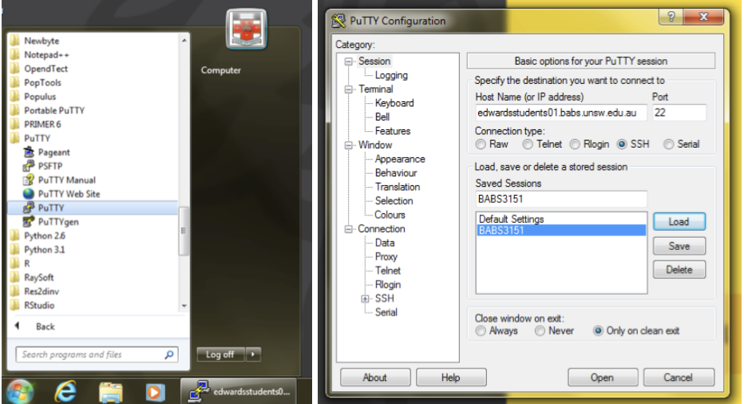
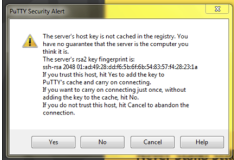
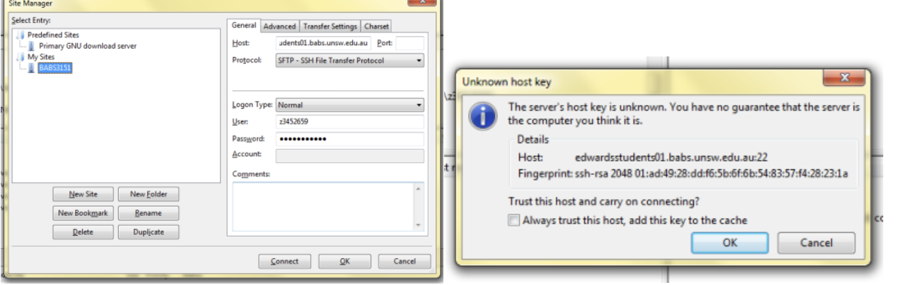
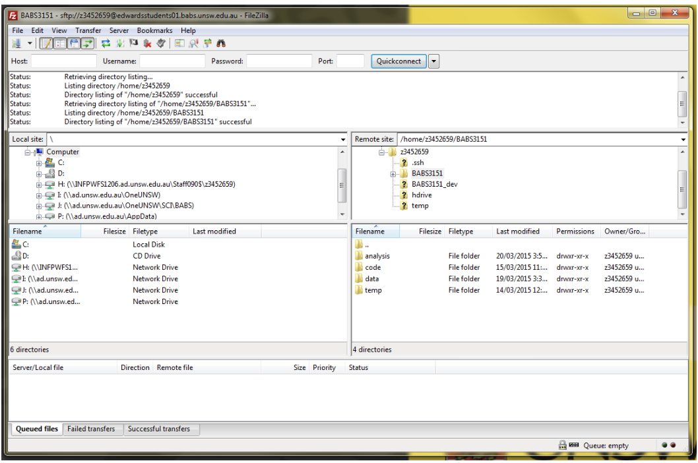

Setting Up on Katana
=====================

> Overview
> --------
> 
> **Objectives**
> 
> *   Setting up your local computer for analysis
>   
> *   Open operating system specific terminal
>   
> *   Log in to the Garvan wolfpack server
>   


In this practical, we are going to work how many "real" bioinformaticians actually work. We are going to (1) install and use a VPN to login to perform (2) high performance computing (HPC). We are going to use a remote server called Katana for the computationally intensive bits and a user-friendly machine (Windows or Mac) to visualise and analyse the results downstream. 

Katana is a shared computational cluster located on campus at UNSW that has been designed to provide easy access to computational resources for groups working with non-sensitive data. It contains over 6,000 CPU cores, 8 GPU compute nodes (V100 and A100), and 6Pb of disk storage. 

For many of you, this is your first time using UNIX. As with all bioinformatics, the best way to learn is by trial and error. 

## Setting up the UNSW VPN
To access the servers off-campus, you will need to set up the UNSW Virtual Private Network (VPN), which gives you access to University resources off-campus as if you were on-campus. Details to set this up can be found here: [https://www.myit.unsw.edu.au/services/students/remote-access-vpn](https://www.myit.unsw.edu.au/services/students/remote-access-vpn). Please contact UNSW IT if you have questions or experience problems with the VPN. If you have recurring issues, please let the course coordinator know. You do not need the VPN if using a UNSW machine on campus.

**Using private computers.**
It is not possible to write this handbook with clear instructions for all combinations of computers and software. As such, the handbook will be written as if you are using a Mac laptop. Please let us know if you are experiencing technical issues through the prac chat channels and we will try to help where we can. However, it is ultimately the responsibility of the student to ensure access to a fit-for-purpose computer.

**The importance of windows real estate.**
One thing you will quickly learn is the importance of being able to see clearly what you are doing. This generally means making the Putty/Terminal window much bigger than it opens by default. Ideally, you want it wide enough to avoid long commands and/or screen output wrapping onto multiple lines. You also want to see as many lines as possible to keep track of the context of what you are doing, and to make sure that important messages (particularly errors) do not disappear off the top of the screen. The precise way to resize your window will depend on your computer/software combination, but seek some advice during a prac session if you cannot find out how to do it.

**NOTE:** You will also find life easier with a bigger monitor – use the biggest screen/resolution that you can, especially when working with anything graphical.


## Logging on to the system
You need to follow different methods of logging on depending on the operating system and computer. 


### Logging on from Mac OSX
If you use a Mac, you simply need to open the **Terminal**. Terminal is generally found in the "Other" folder in Launchpad, or just search for "Terminal" with Spotlight. Once open, **Keep in Dock** for handy future access. You log on to the server using your **zID** and **zPass** and a program that lets you connect via a "secure shell (SSH)".

To log on from Mac OSX (or a UNIX machine), open the Terminal and type at the prompt (replacing zID with your own **zID** ):

```
$ ssh zID@katana.restech.unsw.edu.au
```

Enter your **zPass** when prompted. (If it doesn't work, check that you replaced zID with your own **zID**!)

### Logging on from Windows OS
 - First, check if you have the Command Prompt or PowerShell program locally. You might need to enable SSH using the tutorial recommended by John Reeves: [How to Enable and Use Windows 10's Built-in SSH Commands.](https://www.howtogeek.com/336775/how-to-enable-and-use-windows-10s-built-in-ssh-commands/). 
 - Second, if you do not have either Command Prompt or PowerShell installed, it is likely your laptop has a Windows OS before 10. Therefore, I recommend installing [PuTTY](https://www.putty.org/) which is an open source software. 


### Logging on the server with putty
On UNSW machines, we use a program called **Putty**. On a UNSW machine, Putty is available from the start menu under PuTTY. This will open up the main putty window. In the **Host Name** box type: katana.restech.unsw.edu.au. To save yourself having to type this again, you can **Save** the session as BABS3291 and later **Load** it. (If you change terminal settings, you can save these too.)





(NB. The screenshot shows connection to backup edwardsstudents01.babs.unsw.edu.au server and saves the session as BABS3151 for a different course.)

Hit **Open** and putty will try to connect to the server. The first time you try this, it will recognise the server as a new connection and check that you are sure (precise details may vary):



Click **Yes**. The main terminal window will now open, prompting you to login as: . Enter your **zID** and (press **ENTER** ) then enter your **zPass** when prompted. (If this does not work, check your VPN is working.)



**NOTE:** For security reasons, you will not see anything appear on-screen when typing your password. Trust that it is registering and hit **ENTER** when complete.

### Logging off

To log off the server, simply close the Putty window or type:

```
$ exit
```

**Logging on from outside UNSW.**
 Remember that to log on from outside UNSW, you will need to connect to the university virtual private network (VPN). See https://www.myit.unsw.edu.au/services/students/remote-access-vpn for more information.


### What happens if the server fails?
Whenever working with servers, there is always the risk that something will go wrong. Fear not! We have contingencies (and back up data) in place in case something goes wrong. Please alert the course convenor and/or demonstrators if you start getting unexpected behaviour from the server.

### Writing notes and code
Usually in your other courses, you would write notes in Microsoft Word but that is not ideal for when you are writing code. The reason is that the formatting will not be able to copy and paste from Word to the Terminal. 

Please use a code editor like **VS Codes** to write your notes and code. This can be used by either installing [VSCodes](https://code.visualstudio.com) on your computer or use the [online interface](https://vscode.dev) if you have less space available, or the installation is not working. 

### Optional Cheatsheet for you to fill out
If you would like to fill out a cheatsheet for every command that you use and learn. Please find this document attached as either a [PDF](https://github.com/theheking/babs-rna-seq-2024/blob/e7d091151545ca9da49a625995385348579b3df5/docs/Unix%20Cheatsheet.pdf) or [Word document](https://github.com/theheking/babs-rna-seq-2024/blob/e7d091151545ca9da49a625995385348579b3df5/docs/Unix%20Cheatsheet.docx).


### Extension Task 
If you have any extra time here are a couple of things to do to make your login and navigating around your user login easier. 

1) Login without using ssh without a password (https://www.thegeekstuff.com/2008/11/3-steps-to-perform-ssh-login-without-password-using-ssh-keygen-ssh-copy-id/)
   
2) Form a symbolic link for your scratch location. This means that instead of having to write out the entire location, you can have a fake folder (https://www.faqforge.com/linux/create-shortcuts-in-linux-symbolic-links/)

3) Edit your bashrc file (this is more complicated and not recommended until you are comfortable with UNIX) (https://docs.rc.fas.harvard.edu/kb/editing-your-bashrc/)


Adapted from Handbook by RJ Ewdards

