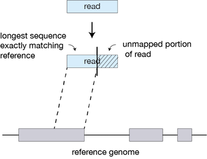

Alignment With Kallisto
======================

> Overview
> --------
> **Questions**
> 
> *  How do I perform pseudo-alignment to map the transcriptome of my sample?
>     
> 
> **Objectives**
> 
> *  Understand the difference between pseudo-alignment and alignment
>     
> *  Select the correct parameters for Kallisto for your sample
>     
> *  Submit your job to the cluster

Introduction
==============
The biological data you get from RNA-seq is amazing, but as you have seen with your papers and the lectures, there is a broad range of types of RNA sequencing, from APEX sequencing to long-read sequencing. Each type can be applied to answer a slightly different biological question. We are using short-read bulk RNA sequencing, and researchers have developed different software to help us infer what is happening in the transcriptome. Different software has been developed to quantify rates of transcription or alternative splicing. We are quantifying transcript level expression per sample. 

Genes vs Transcripts - An example: *ESR1*
=========================================

**Fig. 1 - Gene vs Transcript Example with ESR1**

Above, we can see an example of how multiple transcripts are expressed from one gene, **ESR1**. Each transcript, when translated, can even have distinct biological functions on the protein level. These can even be linked to patient outcomes, such as in the example above; patients with high ERα66 levels had better prognostic outcomes than patients with high ERα36. [1] Every transcript is made up of multiple exons that have been spliced together. The quantification of every transcript can be on a whole transcript or exon-by-exon. There are advantages and disadvantages of both.   

Main methods of quantifying expression
=====================================

You can either align your trimmed, filtered and quality-controlled reads via two methods:
a) *alignment* to the **genome** across *exons* and *introns* e.g. STAR
b) *pseudo-alignment* to the **transcriptome** to *transcripts* e.g. kallisto 

Below is a simplified figure of how pseudo-alignment would work. We use a reference file (FASTA format) containing every transcript for every gene expressed across the human genome. 

**Fig. 2 - Gene vs Transcript Quantification with Kallisto**

|                  | Pseudo-alignment                                                                                                | Alignment                                                                      |
| ---------------- | --------------------------------------------------------------------------------------------------------------- | ------------------------------------------------------------------------------ |
| Input            | RNA-seq                                                                                                         | RNA-seq                                                                        |
| Reference        | Transcriptome                                                                                                   | Genome                                                                         |
| Output           | Number of reads per transcript                                                                                  | List of reads and their coordinates across the genome                          |
| Output file type | Transcript x Count Table                                                                                        | BAM File                                                                       |
| Algorithm        | [Seed-searching](https://hbctraining.github.io/Intro-to-rnaseq-hpc-salmon/lessons/STAR_alignment_strategy.html) | [K-mer](https://tinyheero.github.io/2015/09/02/pseudoalignments-kallisto.html) |

**Fig. 3 - Example of how Alignment works**

Advantages and Disadvantages of Pseudo-alignment
================================================
- Quicker and less memory intensive than traditional aligners
- Transcript level quantification
- Intuitive mapping of reads across multiple transcripts
- Results limited by the quality of transcript annotation (consider different species)
- Cannot quantify SNPs or splice variants
- Limited to known transcripts, not novel 

Despite this, Kallisto is a quick, highly efficient software for quantifying transcript abundances in an RNA-Seq experiment. Kallisto can quantify 30 million reads in less than 3 minutes, even on a typical laptop.

To analyze data with Kallisto, we need several inputs:

1. Trimmed and filtered FASTQ files
2. **A Reference transcriptome**  This file has the sequences for all the known expressed genes. Reference transcriptomes are usually available from repositories like Ensembl and NCBI. We will be using the human reference transcriptome. Unlike a genome, the transcriptome only coding genes.

Step-by-Step Kallisto
======================
Analysis with Kallisto has two main steps:

| Step | Description     | Command                                         | Input                                                                | Output                                          |
| ---- | --------------- | ----------------------------------------------- | -------------------------------------------------------------------- | ----------------------------------------------- |
| 1    | Genome indexing | kallisto index <--index=> <transcriptome.fa.gz> | Reference transcriptome                                             | Kallisto index (no file extension)              |
| 2    | Pseudoalignment | kallisto quant sample.fa.gz                     | FASTQ (one per run of kallisto), kallisto index (from indexing step) | abundances.h5, abundances.tsv and run_info.json |
  

Pseudoalignment and Genomics Word Search Explained
=====================================================
Alignment of reads is an expansive topic. Several reviews cover some of the important topics including [Stark et. al. 2019](https://www.nature.com/articles/s41576-019-0150-2). This [blog post](http://tinyheero.github.io/2015/09/02/pseudoalignments-kallisto.html) and the [kallisto paper](https://www.nature.com/articles/nbt.3519) are further readings to get a deep understanding of the subject.

The Leo Pachter Lab used an analogy to try to reduce this problem to its most basic. 

Traditionally, when software does an alignment, it tries to match a read to the genome.
 
>
>       Genome: ACTACGTAGCCGTCAAATATCCCGGGTATCGTACGATCGACGT
>
>       Read:   AAATTTCCCGGG
>       
  
If we move things around we can find the match:

>
>       Genome: ACTACGTAGCCGTCAAATATCCCGGGTATCGTACGATCGACGT
>
>                       |||| |||||||
>
>       Read:           AAATTTCCCGGG
>  
 
  
In this example, we have one mismatch. Although finding this match was simple, the genome is far more complex.

In the word search below is the word “DNA”. Can you find it? It may take you a while. Searching for words is similar to sequencing reads and trying to match them to the genome. Computers are fast, but just as matching a small word (3 letters) in a large (1639 letter) word puzzle is time-intensive, it take a long time to match millions of short reads against genomes of billions of nucleotides.

>CUSVFVMAASJFHUTMNCCQMBVXOLBEETYHSRBWOSEY
>MOBJEYXAZMPMFENZHQKMHHSCZUXUQYEBQONJVYWH
>LCMIFVSPNMAGIJAOOFCWNYYDETTLMGCDOBSLOPXO
>ZAUSKOGLCYOIKIXZSHOXHLYGZJLRLZMRGHRFRJWN
>HBEOJQLIXUYAIAWMJASRBOVSBHMAHJFPUOXTQIYZ
>LSSCVOGPJCIIMUILZCFKLASLFLQFIZVSYXWJYNMJ
>QPWLYGLRTSTQHYUVFVGGPDMICLGDUMZOVPHFPLOD
>YFZAYPVONRRCPHJPNJVROZEZPBLZNYBQHOVUPOGJ
>SAVCNZWIYQKHJOLKQBHZYGJZKUEHKJLCLXOLMUJF
>YJAGKRFQOQRNAXXXZAZUMMWMLKWNREHDFOLVVYWK
>ATOXWLBGQECNAMWJIMONGSAVKGSHUVUOROVJRJGT
>AJLVEYWLSFPUIYABELQZLYLUGZJGPGWEVPXYCHGO
>IPXOCIPREEDCYTFZHBDTTOIJRWLEYEMMTRIDSMGJ
>BNEZKUNVOXZFIXAAGGYUWAYZSNVUHXJZMMPXBPTE
>QMVXMUJAFUGBBLAVVCGVBDIGDBIDBSHTEVPCJTUB
>ELJIPXDVTMPNCROAPIHZMROJXZFCDHRYWIEUSZST
>ERRCPCLAPIJROAAUKZNDYYKNWKNUNFDKSTLYTXKA
>UAMNKGZVKWMOYGLLWUJOECUNBRUGRPWWUNNVEXYF
>MQYPHTEPNKPLWECXVORINUEHHVLVBNFUJJXNEZYT
>MJDQTZMIRJXMLYUCXYCVFQHHQBERSMGQLRWNYAJP
>IELYQQDAIXJDTUONASHBTLCZISHQWCMJZFAFJOXE
>UGZWMJGDLLRKIZVVLPHYBCULVCAIRMMEQPRRHFHQ
>FFCWSFSQZJTBCVFHUAEECJPXKHMKRKJFBZVQNOMZ
>ZZZEMQQNVWUXDOYBDHSDFLHMAQEWFKWPMIGJVZUT
>ZNEQDNAHXMPBLRVDEBJRJFTDOIWUPFLSIYOOHNQH
>TTMIXMVUMETGMJWFEWCRITKZWZGVMCNQRAPDCJZD
>AXPTCGYNKVFDPALHRQNPKQUBSEGOOQCVUDDHTIWR
>GEMJXKJGSSRAROGDWETVVTZMWUSCYXIKTUFLUIXO
>BDZFSFRPFXHALCKUGTOHGMEHYPRPTFXUSWSKDBWC
>UGGJXCDKYYZZFLDAWLDYJLCRSTDSMLOGPCVAUDZZ
>AHGKHDAGOHYQDKGWDTOGFVOSRKJCPRRENRQRBBPQ
>ABHWPOFZYTGHXPREABCTWABQLZLYBOQVHOMUHGRS
>FPNWCEQGTYJEDRWAVDYKUAZMLVVNTYNRZHPFHYGR
>UAJNXZWZSBLEVYIGLRPFNZLOGRULAHIAHDLXTJXF
>DQEKRQNVJACCBVGABSKTWRPYEFXNEHSICVLHWOIV
>GVOGZWUSLGRGHMVENEYNSBCZRLOZYCMXCYGWUMSG
>LFXDWDWHJYXAXDVWVMTPKQVTAYHNCADYJCNKNDZM
>ASJBGHYSPRUIIVQDAVUQBEEDNQKBKQPMKYQKRIKV
>MWFHPISMEIUIVZVBEUKTFOUADMUDXAJSGYHLXUSP
>OSIVVLZMDTLDMCLGZLEGWLPVPWOLNERAINTAESFR
 
Pseudoalignment is one approach to this computational “word search”. It takes advantage of a trick to speed up performance without losing accuracy. Take the second line in our “DNA” word search puzzle:

>MOBJEYXAZMPMFENZHQKMHHSCZUXUQYEBQONJVYWH

There is no “D” in this line. True, We don’t know that until we read the entire line, but once we realize this line can’t possible be a match without a “D” We can ignore this line. Word search puzzles don’t have to be read in just one direction (words might be on diagonals, backwards, etc.), but now consider what happens in the pseudo alignment “word search”. In this case we are searching not the entire genome, but linear transcripts:

>Transcript 1: CUSVFVMAASJFHUTMNCCQMBVXOLBEETYHSRBWOSEY
>
>Transcript 2: MOBJEYXAZMPMFENZHQKMHHSCZUXUQYEBQONJVYWH
>
>Transcript 3: LCMIFVSPNMAGIJAOOFCWNYYDETTLMGCDOBSLOPXO
>
>Transcript 4: ZAUSKOGLCYOIKIXZSHOXHLYGZJLRLZMRGHRFRJWN
>
>Transcript 5: ZNEQDNAHXMPBLRVDEBJRJFTDOIWUPFLSIYOOHNQH

We can immediately eliminate transcripts that don’t contain the letter D:

>Transcript 3: LCMIFVSPNMAGIJAOOFCWNYYDETTLMGCDOBSLOPXO
>
>Transcript 5: ZNEQDNAHXMPBLRVDEBJRJFTDOIWUPFLSIYOOHNQH

Immediately, the problem is made easier by throwing away transcripts that could not contain the answer. This is not an exact analogy, but basically, rather than trying to match every read to every position in the genome, Kallisto is faster because 1) we are only matching to the transcriptome (a subset of the genome) and 2) we focus only on transcripts that could have generated a particular read.

Step 1 Genome indexing for Kallisto
===================================
There are a few files we need to perform the first step of Kallisto

- Reference transcriptome: A file of all the known transcripts of the human genome
- Reference annotations: A file with information on the location and structure of the genes in the human genome and a file with chromosome details.
  
  
We will now use Kallisto's indexing function to prepare the transcriptome for analysis. The "Index" is a lookup table for the transcriptome that allows Kallisto to search it more easily. First, let's organize our files by creating a new directory to hold our Kallisto work.

    $ mkdir -p /srv/scratch/zID/kallisto_human_ref/
 
First, we must download the reference files from (https://asia.ensembl.org/info/data/ftp/index.html) using `wget`

1. We will need the FASTA file of the cDNA sequence
(https://ftp.ensembl.org/pub/release-109/fasta/homo_sapiens/cdna/Homo_sapiens.GRCh38.cdna.all.fa.gz)

      $ wget https://ftp.ensembl.org/pub/release-109/fasta/homo_sapiens/cdna/Homo_sapiens.GRCh38.cdna.all.fa.gz
      
 OR, if the expected download time is ages, please copy from the communal folder.
 
      $ scp /srv/scratch/babs3291/references/Homo_sapiens.GRCh38.cdna.all.fa.gz /srv/scratch/[your_zID]/kallisto_human_ref/
      
2. We will also need the human GTF file containing coordinates and descriptions for all gene names and locations - we will also download this from Ensembl. (https://ftp.ensembl.org/pub/release-109/gtf/homo_sapiens/Homo_sapiens.GRCh38.109.gtf.gz)  **not needed for index command**
  
        $ wget https://ftp.ensembl.org/pub/release-109/gtf/homo_sapiens/Homo_sapiens.GRCh38.109.gtf.gz 
        
 OR, if the expected download time is large, please copy from the communal folder.
 
        $ scp  /srv/scratch/babs3291/references/Homo_sapiens.GRCh38.109.gtf.gz /srv/scratch/[your_zID]/kallisto_human_ref/
        
Also, must unzip the gtf above. This will take the gtf from being compressed to human readable.
        
        $ gunzip Homo_sapiens.GRCh38.109.gtf.gz 
      
First, we must load Kallisto to our session using `module load` as this is not installed.

        $ module load kallisto

Next, run the indexing command. This prepares the transcriptome so that we can pseudoalign reads to it.
  
    $ kallisto index --index=transcriptome_Homo_sapiens_GRCh38 kallisto_human_ref/Homo_sapiens.GRCh38.cdna.all.fa.gz

Step 2 Pseudoalignment of reads with Kallisto
============================================
In this final step, we will run Kallisto on all of our files to quantify the reads. We will write a for loop to do this. Let's see our trimmed reads once again.

Using your trimmed reads

    $ cd /srv/scratch/zID/babs3291/trimmed_fastq/
  
All instructions for the commands we are using are in the Kallisto manual: https://pachterlab.github.io/kallisto/manual. Since we are using single read data, we need to provide information on the fragment length used for the library (200) and an estimate of the standard deviation for this value - here we will have to guess (20). 

We need to run Kallisto on all of your files. Run the command below on one of your files. 

Single-end:

    $ INPUT_FASTA="/srv/scratch/zID/babs3291/trimmed_fastq/SRR306844chr1_chr3.trimmed.fastq.gz"
 
    $ kallisto quant \
     --single\
     --threads=8\
     --index=[insert_location_your transcriptome]\
     --fragment-length=200\
     --sd=20\
     --output-dir=output\
     --genomebam\
     --gtf=Homo_sapiens.GRCh38.109.gtf ${INPUT_FASTA]
 
 
For paired-end reads, you need two files as input.

    $ INPUT_FASTA="/srv/scratch/zID/babs3291/trimmed_fastq/SRR306844*.trimmed.fastq.gz"
 
    $ kallisto quant \
     --threads=8\
     --index=[insert_location_your_transcriptome] \
     --output-dir=output\
     --genomebam\
     --gtf=Homo_sapiens.GRCh38.109.gtf ${INPUT_FASTA}
     
     
     
kallisto quant produces three output files by default:

- abundance.h5 is an HDF5 binary file containing run info, abundance estimates, bootstrap estimates, and transcript length information length. This file can be read by sleuth
- abundance.tsv is a plaintext file of the abundance estimates. It does not contain bootstrap estimates. Please use the --plaintext mode to output plaintext abundance estimates. Alternatively, kallisto h5dump can be used to output an HDF5 file to plaintext. The first line contains a header for each column, including estimated counts, TPM, effective length.
- run_info.json is a json file containing information about the run
 
 Lets have a look at what the file contains a list of abundances (counts) shows. 

  ` head -n 100 abundance.tsv`
  
Next you will have to calculate an abundance.tsv file for every sample.

Step 3 For Loop to perform pseudoalignment of reads for every sample
========================================================================
Like when you performed trimming, you will need to first request enough computational resources through `qsub -I`. Then you will have to run a for loop to loop through every sample fastq file. The loop you use is dependent on whether you are single end or paired end. 

If you have single-end reads. 

    $ for infile in *.trimmed.fastq.gz
          do
          base=$(basename ${infile} trimmed.fastq.gz)
          outdir="${base}"
          kallisto quant \
           --single\
           --threads=8\
           --index=[insert_location_your transcriptome]\
           --fragment-length=200\
           --sd=20\
           --output-dir=${outdir}\
           --gtf=Homo_sapiens.GRCh38.109.gtf ${infile}

      done

If you have paired-end reads. **Hint: check the string provided as the second part of the basename command matches the prefix of your infile**

     $ for infile in *_1.trimmed.fastq.gz
          do
          base=$(basename ${infile} _1.trimmed.fastq.gz)
          outdir="${base}"
          infiles="${base}*trimmed.fastq.gz"
          kallisto quant \
           --threads=8 \
           --index=/srv/scratch/z5342988/transcriptome_Homo_sapiens_GRCh38 \
           --output-dir=${outdir} \
           --gtf=Homo_sapiens.GRCh38.109.gtf ${infiles}

      done

> Exercise
> --------
> Use kallisto quant to quantify all the transcriptome of your files. 
> **Hint** Be polite and request your turn in the (HPC) queue!
>  
  

> Bonus
> -------
> Using the referenced papers and other research materials you can find, what are some other software tools that could be used as an alternative to Kallisto in RNA-Seq? Do they require the same datasets as Kallisto does in order to run?

  
[1] Chamard-Jovenin, C., Jung, A.C., Chesnel, A. et al. From ERα66 to ERα36: a generic method for validating a prognosis marker of breast tumor progression. BMC Syst Biol 9, 28 (2015). https://doi.org/10.1186/s12918-015-0178-7
[2] Adapted from https://cyverse-leptin-rna-seq-lesson-dev.readthedocs-hosted.com
[3] Adapted from  https://pachterlab.github.io/kallisto/manual
  
