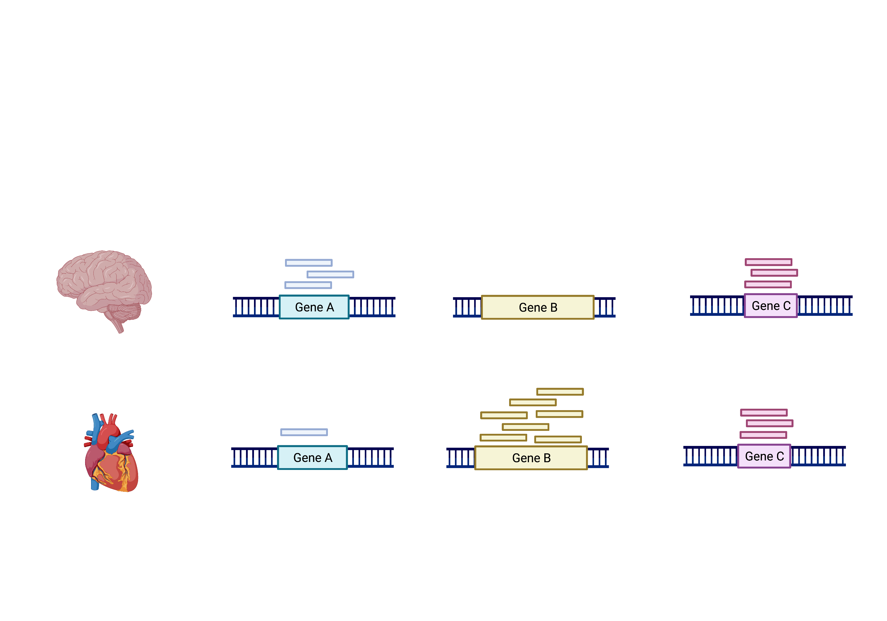
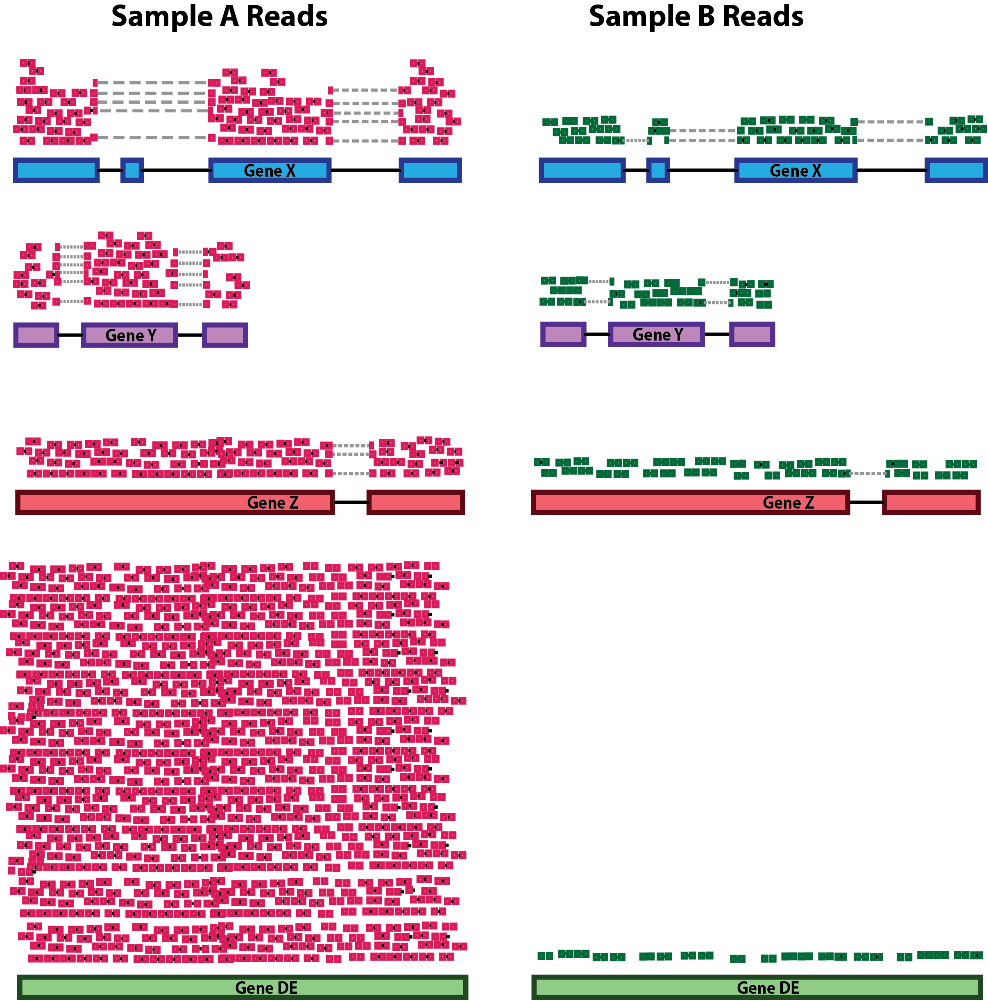
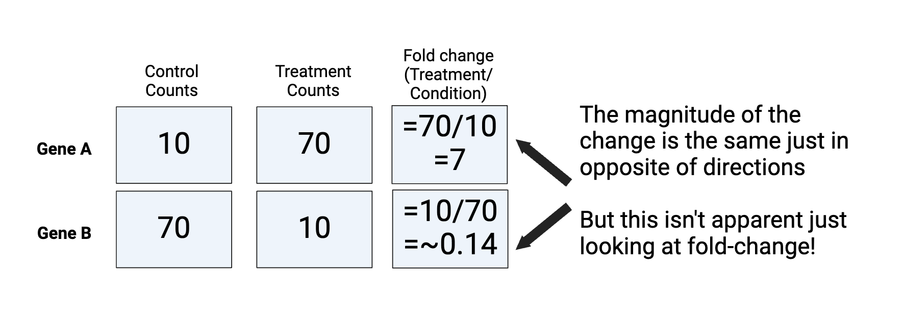
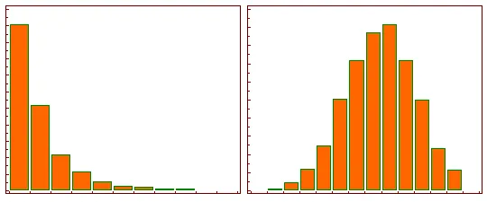
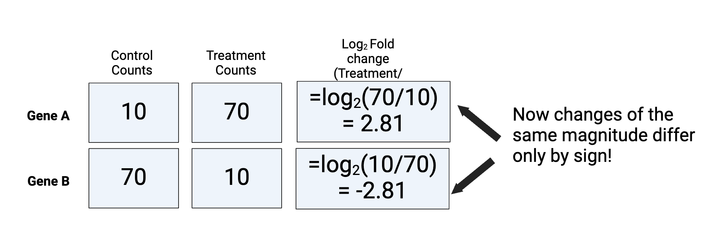
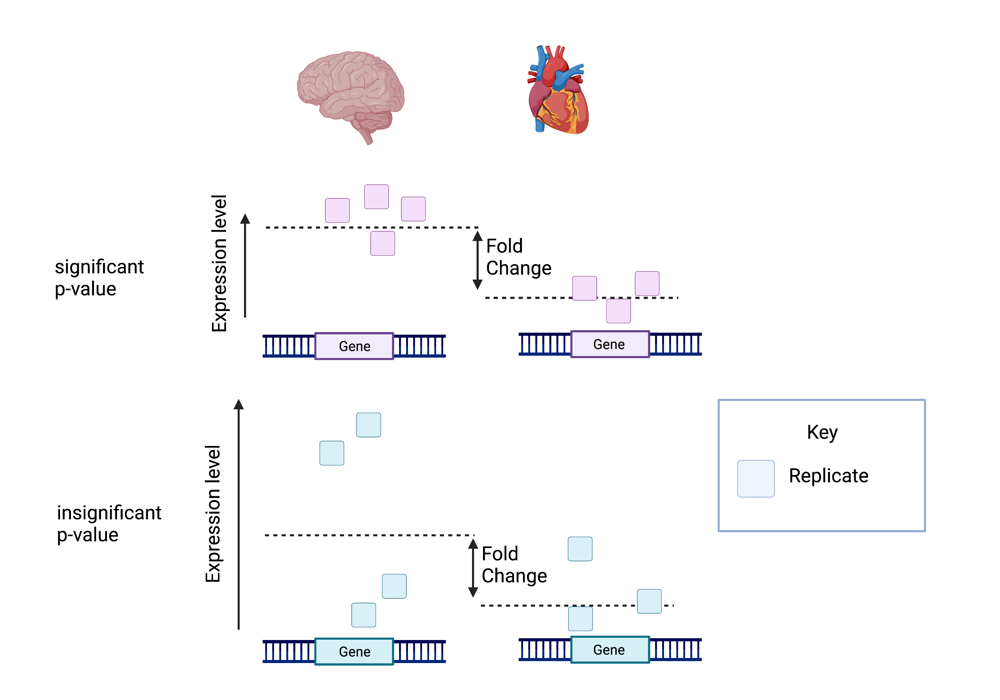

layout: page
title: Week 8B - Theory of Differential gene expression (DGE) analysis
---

 Week 8B - Theory of Differential gene expression (DGE) analysis
=====================================================================================================

> Overview
> --------
> **Questions**
> 
> *   What calculations are being performed with DE?
>     
> 
> **Objectives**
> *   Understand how differential expression is calculated
> *   Understanding how DEGUST is calculating the top differentially expressed genes  

The schema above represents what Kallisto has calculated (except with transcripts). To summarise, the number of reads that map to a transcript in every sample across replicates in control (heart) and test (brain) groups. 
However, we need to calculate the comparisons between the two groups and determine which transcripts change significantly between conditions e.g. Gene A and Gene B, or not, e.g. Gene C.

This process is differential expression analysis. What is calculated at each stage includes:
1. Reads 
2. CPM - counts per million
3. Log fold change, p-value, FDR (false discovery rate)

This is performed by:
  1. Kallisto counts the number of reads that align to one transcript. This is the raw count. However, normalisation is needed to accurately compare gene expression between samples.
     
  2. Normalisation accounts for variabilities between or within raw counts due to technical differences such as read depth. The default in DEGUST is Counts per million (CPM). CPM accounts for sequencing depth. There are better normalisation methods for differential expression analysis between samples. However, we will not learn R in this course, so we must work with what we have. CPM (Counts Per Million) are obtained by dividing counts by the number of counts in the entire sample and multiplying the results by a million
  
  3. Fold change is the change in CPM between conditions. Log Fold change is the logarithm of the fold change calculated. A positive fold change indicates an increase in expression, and a negative fold change indicates a decrease in expression between the control (heart) and test (brain).
  In my experiment, I expect the isoforms that regulate neuronal-related processes to be upregulated and the isoforms that regulate cardiac processes to be downregulated.

 Normalisation of Raw Read Counts
===================================
The first step in the DE analysis workflow is count normalization, which is necessary to compare gene expression between samples accurately. The counts of mapped reads for each gene are proportional to the expression of RNA (“interesting”) and many other factors (“uninteresting”). Normalization is the scaling of raw count values to account for the “uninteresting” factors. This way, the expression levels are more comparable between and within samples.

The main factors often considered during normalization are:

*   **Sequencing depth:** Accounting for sequencing depth is necessary for comparison of gene expression between samples. In the example below, each gene appears to have doubled in expression in _Sample A_ relative to _Sample B_, however this is a consequence of _Sample A_ having double the sequencing depth.
    
    
    
    > _**NOTE:** In the figure above, each pink and green rectangle represents a read aligned to a gene. Reads connected by dashed lines connect a read spanning an intron._
    
*   **Gene length:** Accounting for gene length is necessary for comparing expression between different genes within the same sample. In the example, _Gene X_ and _Gene Y_ have similar levels of expression, but the number of reads mapped to _Gene X_ would be many more than the number mapped to _Gene Y_ because _Gene X_ is longer.
    
    
    
*   **RNA composition:** A few highly differentially expressed genes between samples, differences in the number of genes expressed between samples, or the presence of contamination can skew some types of normalization methods. Accounting for RNA composition is recommended for accurate comparison of expression between samples and is particularly important when performing differential expression analyses \[[1](https://genomebiology.biomedcentral.com/articles/10.1186/gb-2010-11-10-r106)\].
    
    In the example, if we were to divide each sample by the total number of counts to normalize, the counts would be greatly skewed by the DE gene, which takes up most of the counts for _Sample A_, but not _Sample B_. Most other genes for _Sample A_ would be divided by the larger number of total counts and appear less expressed than those in _Sample B_.
    
    

**_While normalization is essential for differential expression analyses, it is also necessary for exploratory data analysis, visualization of data, and whenever you are exploring or comparing counts between or within samples._**

### Common normalization methods

For DEGUST, we had to use CPM. This is not a good method for between-sample comparisons. Manual analysis with R programming is superior to using DEGUST; however, it takes more time and experience to get to grips with!  

Several common normalization methods exist to account for these differences:

| Normalization method                                                                                                          | Description                                                                                                                  | Accounted factors                    | Recommendations for use                                                                                                 |
| ----------------------------------------------------------------------------------------------------------------------------- | ---------------------------------------------------------------------------------------------------------------------------- | ------------------------------------ | ----------------------------------------------------------------------------------------------------------------------- |
| **CPM** (counts per million)                                                                                                  | counts scaled by total number of reads                                                                                       | sequencing depth                     | gene count comparisons between replicates of the same samplegroup; **NOT for within sample comparisons or DE analysis** |
| **TPM** (transcripts per kilobase million)                                                                                    | counts per length of transcript (kb) per million reads mapped                                                                | sequencing depth and gene length     | gene count comparisons within a sample or between samples of the same sample group; **NOT for DE analysis**             |
| **RPKM/FPKM** (reads/fragments per kilobase of exon per million reads/fragments mapped)                                       | similar to TPM                                                                                                               | sequencing depth and gene length     | gene count comparisons between genes within a sample; **NOT for between sample comparisons or DE analysis**             |
| DESeq2’s **median of ratios** \[[1](https://genomebiology.biomedcentral.com/articles/10.1186/gb-2010-11-10-r106)\]            | counts divided by sample-specific size factors determined by median ratio of gene counts relative to geometric mean per gene | sequencing depth and RNA composition | gene count comparisons between samples and for **DE analysis**; **NOT for within sample comparisons**                   |
| EdgeR’s **trimmed mean of M values (TMM)** \[[2](https://genomebiology.biomedcentral.com/articles/10.1186/gb-2010-11-3-r25)\] | uses a weighted trimmed mean of the log expression ratios between samples                                                    | sequencing depth, RNA composition    | gene count comparisons between samples and for **DE analysis**; **NOT for within sample comparisons**                   |

### Example of normalisation calculation with RPKM/FPKM (not recommended for between sample comparisons)

While TPM and RPKM/FPKM normalization methods both account for sequencing depth and gene length, RPKM/FPKM are not recommended. **The reason is that the normalized count values output by the RPKM/FPKM method are not comparable between samples.**

Using RPKM/FPKM normalization, the total number of RPKM/FPKM normalized counts for each sample will be different. Therefore, you cannot compare the normalized counts for each gene equally between samples.

**RPKM-normalized counts table**

| gene                         | sampleA   | sampleB   |
| ---------------------------- | --------- | --------- |
| XCR1                         | 5.5       | 5.5       |
| WASHC1                       | 73.4      | 21.8      |
| …                            | …         | …         |
| Total RPKM-normalized counts | 1,000,000 | 1,500,000 |

For example, in the table above, SampleA has a greater proportion of counts associated with XCR1 (5.5/1,000,000) than does sampleB (5.5/1,500,000) even though the RPKM count values are the same. Therefore, we cannot directly compare the counts for XCR1 (or any other gene) between sampleA and sampleB because the total number of normalized counts are different between samples.

> _NOTE:_ [This video by StatQuest](http://www.rna-seqblog.com/rpkm-fpkm-and-tpm-clearly-explained/) shows in more detail why TPM should be used in place of RPKM/FPKM if needing to normalize for sequencing depth and gene length.

Fold Change and Why We Log
==========================

Fold change can be calculated as the ratio between treatment and condition as below. However, it is limited because:
a) the magnitude of the change is the same but in opposite directions 
b) it is challenging to make a plot that shows 7 and 0.14 

 

This is why we use log for normalisation. 

After log transformation, the data's skew has been removed. As it is now symmetrical, changes of the same magnitude differ only by sign. In fact, any base can be used for the log to achieve this, but the standard in RNA-seq is Log2, as it is most easy to interpret. A log2FC of 1 represents a doubling of the counts. It is also useful for  statistical tests later in the analysis and visualisation.

 

Fold Change and Significance
============================

The attached picture shows that despite the same log fold change, the lower p-value is correlated with lower intragroup variability. 
This means we can be more certain that the difference in fold change is significant.

Calculating the false discovery rate (FDR) is essential as we test significance across hundreds of genes and samples. A certain number of these log fold change calculations could have occurred by chance. However, by calculating the FDR, we can confidently identify the isoforms with differential expression between the brain and cerebellum.

This is what is displayed in our DEGUST graphs. 

____
This has been adapted from [Training-modules](https://github.com/hbctraining/Training-modules). 

