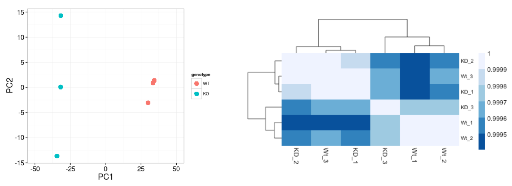

 Week 8C - Understanding QC on Sample and Gene-level and Getting to Grips With Gene Ontology
=============================================================================================

> Overview
> --------
>  **Objectives**
> *   Understand what isoforms are being used as input to gene ontology analysis
>   

---------------------------------------

**The differential expression analysis steps are shown in the flowchart below in green**. 

**These are automatically calculated by inputting our gene count matrix into DEGUST**

1. First, the count data needs to be normalized to account for differences in library sizes and RNA composition between samples. 

2. Then, we will use the normalized counts to make some plots for QC at the gene and sample level. 

3. Finally, the differential expression analysis is performed using your tool of interest.

Quality Control
===============

The next step in the differential expression workflow is QC, which includes sample-level and gene-level steps to perform QC checks on the count data to help us ensure that the samples/replicates look good.

Sample-level QC
=================

A useful initial step in an RNA-seq analysis is often to assess overall similarity between samples:

*   Which samples are similar to each other, which are different?
*   Does this fit to the expectation from the experiment’s design?
*   What are the major sources of variation in the dataset?

Log2-transformed normalized counts are used to assess similarity between samples using the most common of which is Principal Component Analysis (PCA) and hierarchical clustering. PCA is analogous to the multidimension scaling used in DEGUST. Using log2 transformation, tools aim to moderate the variance across the mean, thereby improving the distances/clustering for these visualization methods.

Sample-level QC allows us to see how well our replicates cluster together, as well as, observe whether our experimental condition represents the major source of variation in the data. Performing sample-level QC can also identify any sample outliers, which may need to be explored to determine whether they need to be removed prior to DE analysis.

Gene-level QC
=================

In addition to examining how well the samples/replicates cluster together, there are a few more QC steps. Prior to differential expression analysis, it is beneficial to omit genes that have little or no chance of being detected as differentially expressed. This will increase the power to detect differentially expressed genes. The genes omitted fall into three categories:

*   Genes with zero counts in all samples
*   Genes with an extreme count outlier
*   Genes with a low mean normalized counts

Understanding in Context to Gene Ontology Graphs
==========================================
The gene ontology graphs represent biological processes upregulated in the test (cerebellum) compared to the control (heart). 
The differentially expressed genes you identified using the parallel coordinates graph are included.
Previously in week 9, I selected the top 100 or so isoforms for input into my GEO analysis. 
Again in my experiment, I expect the isoforms that regulate neuronal-related processes to be upregulated.
These neuronal processes would be reflected in the GO terms enriched in my Manhattan plot outputted by GO: Profiler.

The other acronyms of database found on the x-axis of the manhatten plot are different, complementary databases or resources of molecular function:  
- KEGG - (Kyoto encyclopedia of genes and genomes), which is useful to map the pathways usually to do with metabolism, human diseases, cellular processes. 
- REAC- represents Reactome another database for biological pathways. 
- HPA - the human protein atlas. 
- MIRNA is miRTarBase
- WP is Wikipathways
- CORUM- comprehensive of mammalian protein complexes. Usually, the terms that are enriched are self-explanatory, e.g. CORUM:7586 FOXO1-ESR1 complex. This would represent an enrichment of genes that code for proteins within this complex. 
- HP stands for Human Phenotype Ontology which is a database of disease related phenotypic abnormalities. So for each disease e.g. Marfan Syndrome you would have different annotations including HP:0001519 for disproportionate tall stature ect. 

____
This has been adapted from [Training-modules](https://github.com/hbctraining/Training-modules)  and  from [kyawsawhtoon](https://medium.com/@kyawsawhtoon/log-transformation-purpose-and-interpretation-9444b4b049c9)

