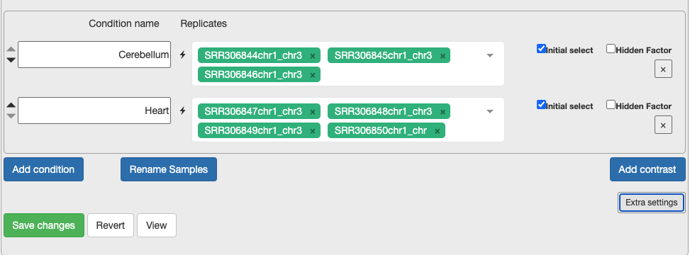
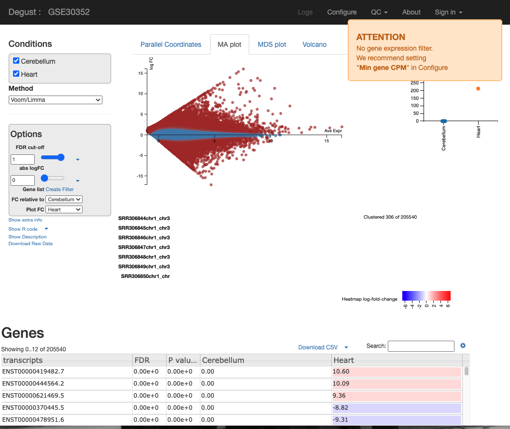
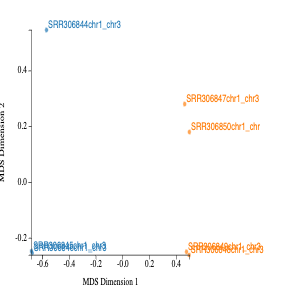
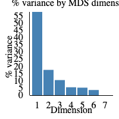
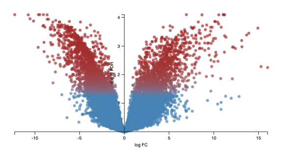
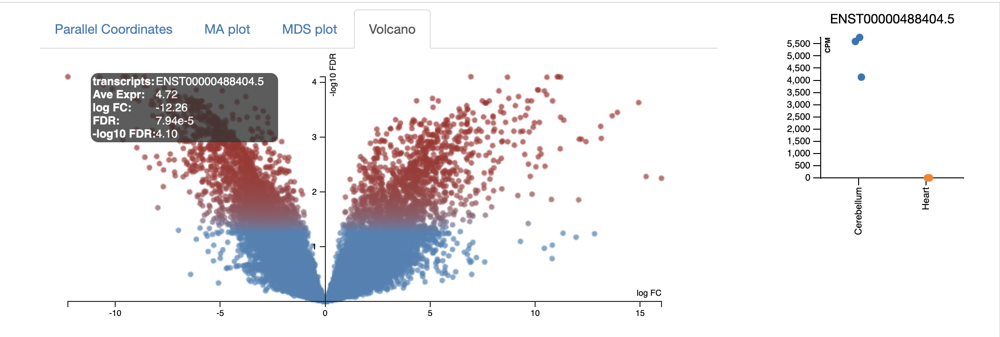
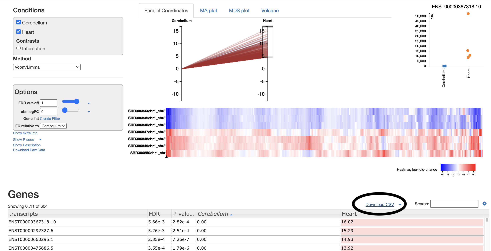
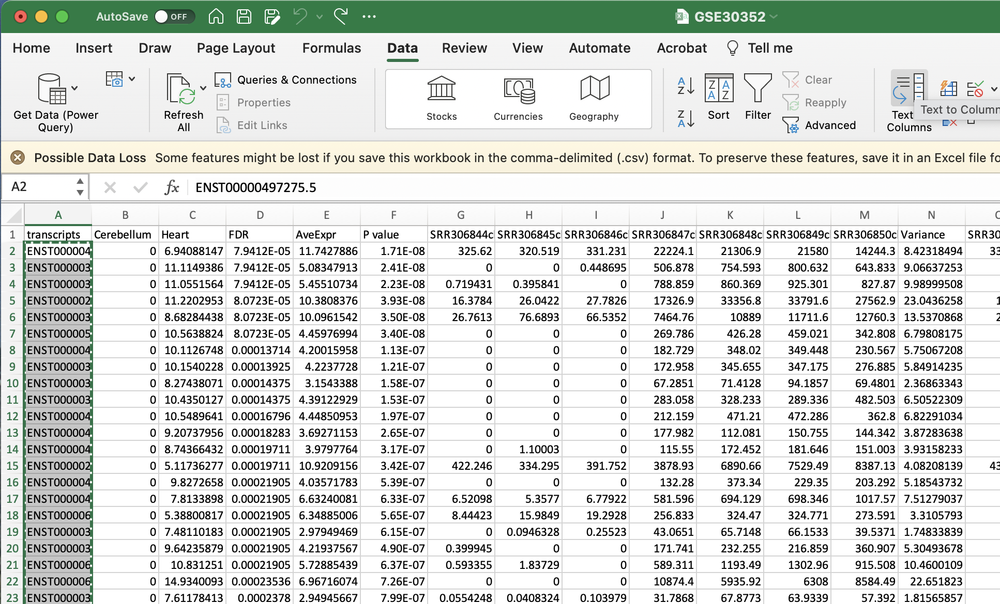

Week 9 - Differential gene expression (DGE) analysis
====================================================

> Overview
> --------
> **Questions**
> 
> *   What are the top DEGs in our experiment? 
>     
> 
> **Objectives**
> 
> *   Use DEGUST to output top differentially expressed genes  
>  
> *   Understand the best diagrams to show differentially expressed genes
> 

---------------------------------------

The next step in the RNA-seq workflow is the differential expression analysis. The goal of differential expression testing is to determine which genes are expressed at different levels between conditions. These genes can offer biological insight into the processes affected by the condition(s) of interest.

The steps outlined in the gray box below we have already discussed, and we will now continue to describe the steps in an **end-to-end gene-level RNA-seq differential expression workflow**.

So what does the count data actually represent? The count data used for differential expression analysis represents the number of sequence reads that originated from a particular gene. The higher the number of counts, the more reads associated with that gene, and the assumption that there was a higher level of expression of that gene in the sample.

***Note: We are using features that are transcripts, not genes***
Usually you would sum all the transcript expression for a given gene. This would change a transcript x count matrix to form a gene x count matrix. To make the pipeline simple- we will *not* be doing this. 

Counts and CPM
---------------
Kallisto counts the number of reads that align to one transcript. This is the *raw count*, however normalisation is needed to make accurate comparisons of gene expression between samples. Normalisation is used to account for variabilities between or within *raw counts* due to technical differences such as read depth. The default in DEGUST is *Counts per million (CPM)*. CPM accounts for sequencing depth. This is not the best normalisation method for differential expression analysis between samples. However, we are not going to learn R in this course so have to work with what we have. 

Using DEGUST
-------------

We will be using the online method  (https://degust.erc.monash.edu/). 

1. Preparing data to be compatable for use in DEGUST
2. Transferring locally
3. Uploading metadata and counts table  to DEGUST 
4. Understanding the output 
5. Gene ontology output
6. Taking into account confounding effects **(Extra found in tutorial)**

Preparing DEGUST Compatible Data
--------------------------------

Log onto katana. Change directory into the location that contains your aligned kallisto output `abundance.tsv`.

        $ cd /srv/scratch/zID/babs3291/trimmed_fastq/Adapter_SRR306844chr1_chr3
        $ ls abundance.tsv
      
This file contains the counts of one sample. You will have to form a count matrix table for input into DEGUST.  

Please download this [script](https://github.com/theheking/babs-rna-seq-2024/blob/gh-pages/metadatafiles/merge_abundance_files.sh) using `wget`. In the main folder that you have your kallisto results.

        $ cd /srv/scratch/zID/babs3291/trimmed_fastq
        $ wget https://github.com/theheking/babs-rna-seq-2024/raw/gh-pages/metadatafiles/merge_abundance_files.sh 
        $ bash merge_abundance_files.sh
        This scripts is to concatenate all abundance tsv to form count matrix table
        ***Please be in the main directory which contains /samplename/abundance.tsv***
        
 This should output one file called `transcript_counts.csv`. Please check that it is:
 1) comma seperated using `head -n 3`
 2) the number of samples should equal the number of columns + 1
 3) has the 205541 lines using `wc -l`
    
  
This `transcript_counts.csv` is the file you will transfer to your local computer. 

Transferring to local computer
------------------------------

You will now be transferring your file to your local computer. First move into a directory that you can access (e.g. Windows used pushed, see Week2C Writing Scripts. 
   
    $ cd ~/Desktop
    $ scp zID@katana.restech.unsw.edu.au:"/srv/scratch/zID/babs3291/trimmed_fastq/transcript_counts.csv" .
    

Uploading metadata and counts table to DEGUST 
-----------------------------------------------

Open the [DEGUST homepage](https://degust.erc.monash.edu/). This is where you will upload your counts file and have a internet-based interface to understand the DEGs in your samples. Usually this would be performed manually through R analysis using DESeq2 or limma (the package that is automated on this website). 

a. Click **Upload your counts file**
b. Click **Choose file** and select your `transcripts_counts.csv` file and select **Upload**.
c. Now we must configure the correct settings.
        - Write in the name of your project
        - Input type as RNA-seq counts
        - Select Comma seperated
        - Choose the info column to contain the transcripts
        
 

d. Continue to configure settings. 
        - Min Gene Count to 2 and min sample number to 2. As you are only looking at a subset of chromosomes then, you need to remove the noise.
        - Select the replicates for each condition. This is what will be in the original metadata file found in Practical Overview --> Sample Datasets --> SraRunTable File.
        - For each condition, choose the relevant samples. At the moment, please just select the control and test conditions. In section 5, you can also include confounding effects.  
        
 

***Extension Task: Why is it not recommended to have only one replicate? If you put only one replicate in a condition, does DEGUST output an error message or have a change in output?***

Understanding the output 
----------------------------
You will see a screen similar to the screenshot below. 
 

On the LHS is a small box containing the:
- **FDR (False discovery rate cut-off)** - Due to probability, there is a small chance that an event will occur by chance. This is a filter to remove the background noise of events. For us the event, is differentially expressed genes, so this removes DE genes that are likely to be due to chance, and not as a result of actual biological differences between control and test samples. 
- **abs logFC (absolute log fold change)** - this is the metric to calculate the difference between counts. Please see the theory lesson for a more indepth understanding of how this is calculated. In essense the larger the abs logFC, the larger the difference between expression of a transcript between heart and cerebellum. If abslogFC = 0, there is no difference in expression.
- **FC relative to** - control of which condition is the *baseline*.

There are four tabs at the top of the screen - Parallel Coordinates, MA plot, MDS plot and Volcano plot. There is too many user configured settings and output graphs  to explain all, so we are going to skip the MA plot. So, I will highlight the most pertinent graphs. For the practical writeup, you need to investigate any disease specific patterns and research the role of the most DEGs idenitfied in these figures.

1. The MDS in MDS plot stands for multidimension scaling. It is a method to visualise the similarity or dissimalarity between each sample. We would expect the samples to cluster based on tissue. This is because we would expect the cerebellum samples to be more similar to each other than heart samples. In our MDS plot, we can see SRR306844chr1_chr3 clustering distinctly from all other samples. If not clustering well, it is an indicator of contaminated sample or confounding factor not taken into account. 
 

2. The elbow plot to the right hand side of the screen displays the percentage of variance that is displayed in the MDS plot. If 1 is 100% it would mean that 100% of biological variation is described with dimension 1. In our sample, 55% of biological variance is found in dimension 1, and 15% in dimension 2. Therefore around 70% of biological variation is being displayed in the MDS plot above. 
 

3. The volcano plot shows on the shows the -log10FDR against the logFC.  The higher the value of the -log10 FDR, the greater the confidence in the log FC being not random. The larger the logFC 

Every dot represents an isoform (not a gene). This is because we are using the transcriptome as the reference and each transcript name begins with "ENST". An example of a transcript that has a negative log FC due to being highly expressed in cerebellum, relative to the `control` heart sample. It codes for a transcript of the gene [ZIC1](http://asia.ensembl.org/Homo_sapiens/Gene/Summary?g=ENSG00000152977;r=3:147393422-147510293) which is a member of the transcription factor C2H2-type zinc finger family that are key during developement. has been documented in medulloblastoma, a chldhood brain tumour.  

4. Parallel coordinates tab is fairly self explanatory. Each line represents an isoform, each line represents the logFC. All isoforms in the control with have a absLogFC of 0 as it is the baseline, where expression is relative to. The most useful section for this is the drag and drop to highlight transcripts of interest that are then visualised in the heatmap below, and in the csv below. 

For example, I select the top ~100 isoforms and then download the csv. This csv will be used for further gene ontology visualisations (see Gene Ontology section). 

These isoforms are the most upregulated genes in cerebellum relative to heart. Therefore the gene ontology results represent processes enriched in the genes found to be upregulated in the cerebellum. 

For your own analysis you can choose more/less isoforms and, upregulated or downregulated. 

Exploring Gene Ontology Analysis
-----------------------------------
Gene ontology is a tool used to understand the molecular function, biological process and cellular components of the genes that are differentially expressed across conditions. 

1. Create a list of transcript IDs. 
After selecting download csv, you should open your csv in either Google Sheets or Microsoft Excel. 

Please remove the final decimal points from every transcriptID by selecting Data to Columns and using "." as the delimiter. I will show you how remove the decimal points in Excel as that is my system default. 
1. Select Text to Columns
2. Select delimited 
3. Select other and enter in a fulls-stop (.) 
4. Select finish
5. Ignore the alert 
6. Copy the list of transcripts that now should be formatted to from a list of transcript IDs such as ENST00000497275.5 to ENST00000497275. 

2. Convert transcript IDs to GeneIDs using [GO Convert Website](https://biit.cs.ut.ee/gprofiler/convert).
Copy and paste the transcript IDs to the gene conversion. This will output genes that match isoforms of interest.

Select ENSG as the Target Namespace

Click the little clipboard logo next to `converted alias`. This will copy all the gene names to your clipboard. 

3. Find gene ontology profile using [GO ontology profile](https://biit.cs.ut.ee/gprofiler/gost).

Paste this list of geneIDs as input into gene ontology enrichment website and select run query. 
The top most enriched GO terms will be displayed in an assortment of figures. For example, one of the top enriched processes is circulatory system development, which is unsuprising as we are looking at genes that are DE in heart samples vs cerebellum. 

Note the choice of background set is key for getting accurate results. This is because frequency of genes annotated to a GO term is relative to the entire background set. [Gene Ontology Website](http://geneontology.org/docs/go-enrichment-analysis/) explains this articulately:
**"For example, if the input list contains 10 genes and the enrichment is done for biological process in S. cerevisiae whose background set contains 6442 genes, then if 5 out of the 10 input genes are annotated to the GO term: DNA repair, then the sample frequency for DNA repair will be 5/10. Whereas if there are 100 genes annotated to DNA repair in all of the S. cerevisiae genome, then the background frequency will be 100/6442." **

Please explore all of the different figures. Depending on your samples and your biological question the results could be interesting or not... 

Beginning section Edited from [Training-modules](https://github.com/hbctraining/Training-modules) 
